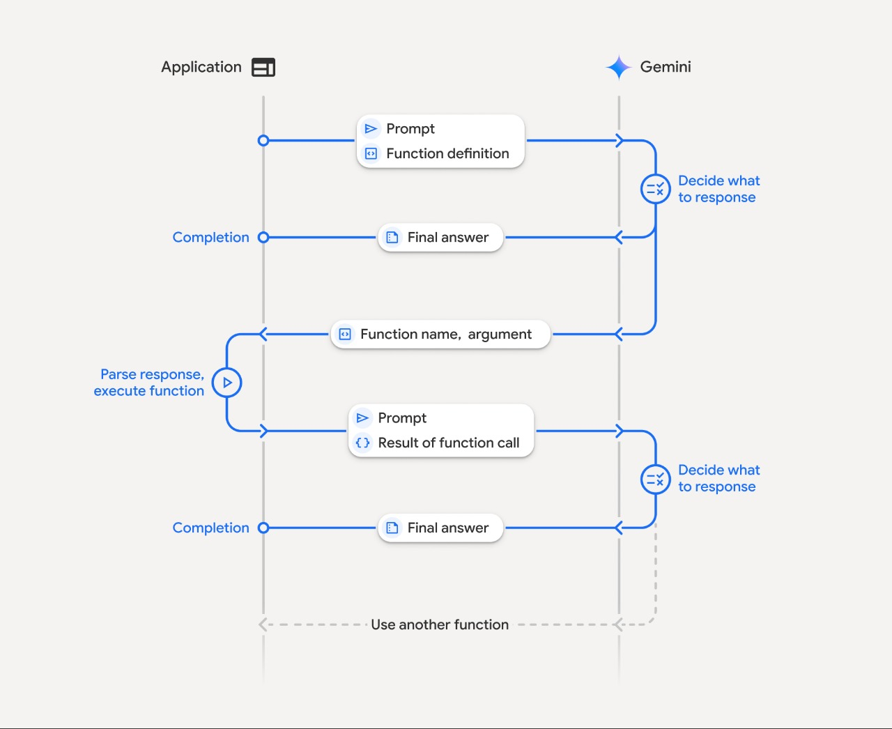

# Finance Chatbot API

A high-performance, concurrent API for streaming financial information and analysis through a conversational interface. This service processes user queries related to Vietnamese financial markets, analyzes financial reports, and provides real-time stock information.

## Features

- **Streaming Responses**: Real-time streaming of AI-generated responses using Server-Sent Events (SSE)
- **Concurrent Request Handling**: Efficiently processes multiple concurrent user requests
- **Session Management**: Maintains conversation history within sessions
- **Financial Analysis Tools**: Integration with stock information tools and search engines
- **Multilingual Support**: Handles queries in Vietnamese and English
- **Clear Session History**: API endpoint to clear conversation history
- **API Key Rotation**: Automatic rotation of API keys to handle rate limits
- **Model Fallback**: Graceful degradation to backup models when needed
- **Adaptive Retries**: Exponential backoff retry mechanism for handling rate limits

## System Architecture

```
┌─────────────────┐        ┌───────────────────┐        ┌───────────────────────┐
│                 │        │                   │        │                       │
│  Client Request │──────▶ │ FastAPI Router    │──────▶ │ Chatbot Service       │
│  (Web/Mobile)   │        │ (/chat-stream)    │        │ (SessionID Management)│
│                 │        │                   │        │                       │
└─────────────────┘        └───────────────────┘        └───────────┬───────────┘
                                                                    │
                                                                    ▼
                        ┌────────────────────────────────────────────────────────┐
                        │                                                        │
                        │                   LLM Service                          │
                        │                                                        │
                        │  ┌────────────────┐    ┌─────────────────────────┐     │
                        │  │                │    │                         │     │
                        │  │  API Key       │◀──▶│  Gemini AI Model        │     │
                        │  │  Manager       │    │  (Primary + Backups)    │     │
                        │  │                │    │                         │     │
                        │  └────────────────┘    └─────────────────────────┘     │
                        │                                                        │
                        └───────────────┬────────────────────────────────────────┘
                                        │
                                        ▼
                        ┌────────────────────────────────────────┐
                        │                                        │
                        │           Financial Tools              │
                        │                                        │
                        │  ┌───────────────┐ ┌───────────────┐   │
                        │  │               │ │               │   │
                        │  │ Stock Info    │ │ Search        │   │
                        │  │ Tool          │ │ Engine        │   │
                        │  │               │ │               │   │
                        │  └───────────────┘ └───────────────┘   │
                        │                                        │
                        └────────────────────────────────────────┘
```
## Function Calling flow


## API Endpoints

### POST `/api/v1/chat-stream`

Processes a chat query and returns a streaming response.

**Request Body:**
```json
{
  "query": "Thông tin về những biến động gần đây của tập đoàn VNM",
  "session_id": "user1_session"
}
```

**Response:**
Streaming response with Server-Sent Events (SSE) format.

### POST `/api/v1/clear-chat`

Clears the conversation history for a specific chat session.

**Query Parameters:**
- `session_id`: Session ID to clear

**Response:**
```json
{
  "status": "success",
  "message": "Chat history cleared"
}
```

## Flow of Operation

1. **Request Handling**:
   - User sends a query through the client application
   - FastAPI router receives the request and validates parameters
   - Router routes the request to the Chatbot Service

2. **Session Management**:
   - Chatbot Service creates or retrieves an existing session for the user
   - Previous conversation history is loaded from the session

3. **LLM Processing**:
   - Query is formatted with appropriate context and system instructions
   - LLM Service selects an available API key from the key manager
   - Query is sent to the Gemini AI model with tools configuration

4. **Tool Execution**:
   - If the model needs financial data, it calls the appropriate tool
   - Financial tools retrieve stock information or search for relevant data
   - Tool results are fed back to the model to complete the response

5. **Response Streaming**:
   - Generated content is streamed back to the client as SSE events
   - Each chunk is processed and delivered in real-time
   - Complete response is stored in conversation history

6. **Error Handling**:
   - Rate limits trigger API key rotation and exponential backoff
   - If primary model fails, service falls back to backup models
   - Robust concurrency handling prevents resource contention

## Concurrency Model

The system uses asyncio for efficient handling of concurrent requests:

- Each chat session is managed independently
- Thread-safe locks protect shared resources
- API requests are limited by a semaphore to prevent overwhelming the LLM service
- Streaming responses allow for efficient bandwidth usage
- The singleton pattern ensures resource sharing between requests

## Setup and Installation

1. Clone the repository
2. Install dependencies:
   ```bash
   pip install -r requirements.txt
   ```
3. Configure environment variables:
   ```
   MODEL_NAME=your_default_model
   MONGODB_URI=your_mongodb_connection_string
   GEMINI_API_KEY_1=your_primary_api_key
   GEMINI_API_KEY_2=your_backup_api_key
   ```
4. Run the server:
   ```bash
   uvicorn src.main:app --host 0.0.0.0 --port 8010 --workers 4
   ```

## Testing Concurrent Requests

The repository includes a test script that simulates multiple concurrent users sending queries to the chatbot. To run the test:

```bash
python -m src.api.v1.router
```

This will execute a test with 20 simulated users sending financial queries in Vietnamese, displaying formatted output in the terminal.

## Sample Queries

```
Thông tin về những biến động gần đây của tập đoàn VNM
Phân tích báo cáo tài chính của FPT năm 2023
Tình hình kinh doanh của Vietcombank 6 tháng đầu năm
So sánh hiệu quả kinh doanh giữa các ngân hàng niêm yết
Thông tin các cổ phiếu ngành công nghệ đang tăng trưởng tốt
```

## Extending the Chatbot

To add new financial tools or capabilities:

1. Create new tool functions in the `src/services/tools` directory
2. Register tools in the `automation_flow_stream` method
3. Update prompts in `src/core/prompt.py` to leverage new capabilities

## Performance Optimizations

- **API Key Rotation**: Automatically switches between multiple API keys to handle rate limits
- **Model Fallback**: Falls back to secondary models when primary model is unavailable
- **Concurrent Request Handling**: Uses asyncio to process multiple requests simultaneously
- **Semaphore Controls**: Limits concurrent API requests to prevent overwhelming the service
- **Streaming Responses**: Reduces time-to-first-byte and improves user experience
- **Exponential Backoff**: Implements intelligent retry mechanisms for transient errors

## Error Handling

The API includes robust error handling with:
- Detailed logging via Loguru
- HTTP exceptions with meaningful error messages
- Graceful degradation under high load
- Rate limit detection and mitigation
- Automatic recovery from transient errors

## License

[Specify your license here]