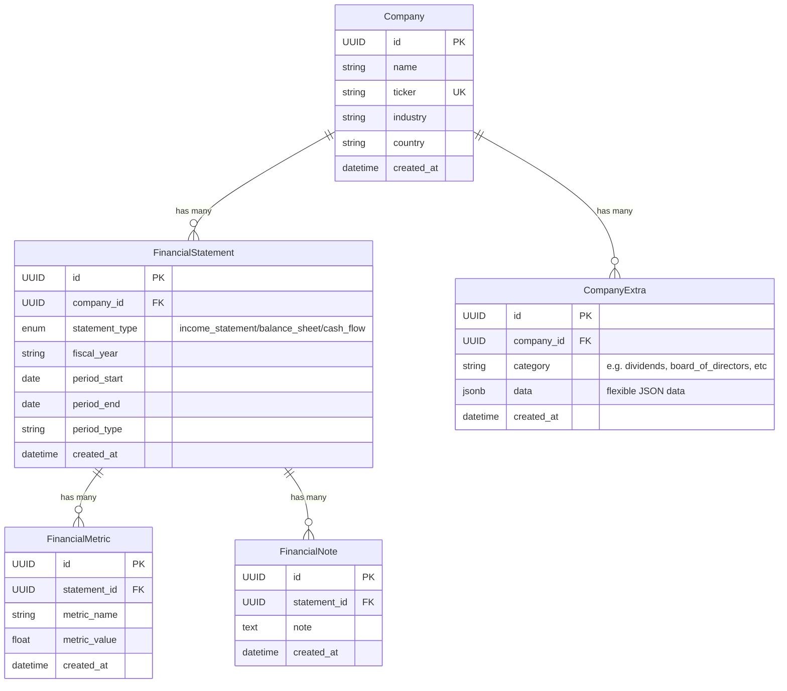

```mermaid
erDiagram
    Company ||--o{ FinancialStatement : "has many"
    Company ||--o{ CompanyExtra : "has many"
    FinancialStatement ||--o{ FinancialMetric : "has many"
    FinancialStatement ||--o{ FinancialNote : "has many"
    
    Company {
        UUID id PK
        string name
        string ticker UK
        string industry
        string country
        datetime created_at
    }
    
    FinancialStatement {
        UUID id PK
        UUID company_id FK
        enum statement_type "income_statement/balance_sheet/cash_flow"
        string fiscal_year
        date period_start
        date period_end
        string period_type
        datetime created_at
    }
    
    FinancialMetric {
        UUID id PK
        UUID statement_id FK
        string metric_name
        float metric_value
        datetime created_at
    }
    
    FinancialNote {
        UUID id PK
        UUID statement_id FK
        text note
        datetime created_at
    }
    
    CompanyExtra {
        UUID id PK
        UUID company_id FK
        string category "e.g. dividends, board_of_directors, etc"
        jsonb data "flexible JSON data"
        datetime created_at
    }

    %% Constraints
    %% unique(FinancialStatement.company_id, FinancialStatement.statement_type, FinancialStatement.fiscal_year)
    %% unique(FinancialMetric.statement_id, FinancialMetric.metric_name)
    %% unique(CompanyExtra.company_id, CompanyExtra.category)
```